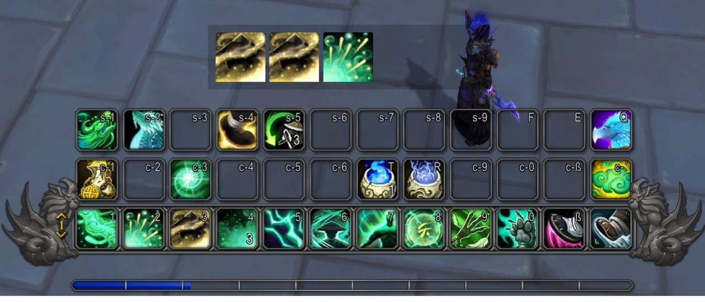

 

---

**SpellHistory** is a lightweight and customizable WoW addon that displays your recently cast and interrupted spells in a movable frame.

## Features

- **Visual Spell History**: See your last cast spells displayed as icons in a row
- **Interrupted Spell Tracking**: Red overlay on interrupted/failed spells
- **Fully Customizable**:
  - Adjust number of spells shown (5-30)
  - Icon size (20-80 pixels)
  - Spacing between icons
  - Background transparency
  - Toggle border visibility
  - Optional: Hide interrupted spells
- **Movable & Lockable**: Drag the frame anywhere, then lock it in place
- **Tooltips**: Hover over any spell to see details
- **Localized**: Full German and English translations
- **WoW Midnight Compatible**: Built for WoW 12.0+

## Usage

### Commands

- `/spellhistory` or `/sh` - Open settings panel
- `/spellhistory clear` - Clear spell history

## Settings Overview

| Setting                     | Description                      | Default  |
| --------------------------- | -------------------------------- | -------- |
| **Number of Spells**        | How many spells to display       | 10       |
| **Icon Size**               | Size of spell icons in pixels    | 40       |
| **Spacing**                 | Space between icons              | 5        |
| **Lock Frame**              | Prevent frame from being moved   | Disabled |
| **Show Border**             | Display border around frame      | Enabled  |
| **Background Transparency** | 0% = transparent, 100% = opaque  | 50%      |
| **Show Interrupted Spells** | Display failed/interrupted casts | Enabled  |

## Screenshots

## Support

- **Issues & Bug Reports**: [GitHub Issues](https://github.com/stgeipel/SpellHistory/issues)
- **Feature Requests**: [GitHub Issues](https://github.com/stgeipel/SpellHistory/issues)
