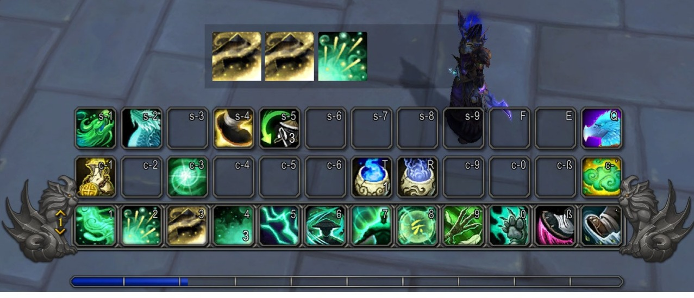
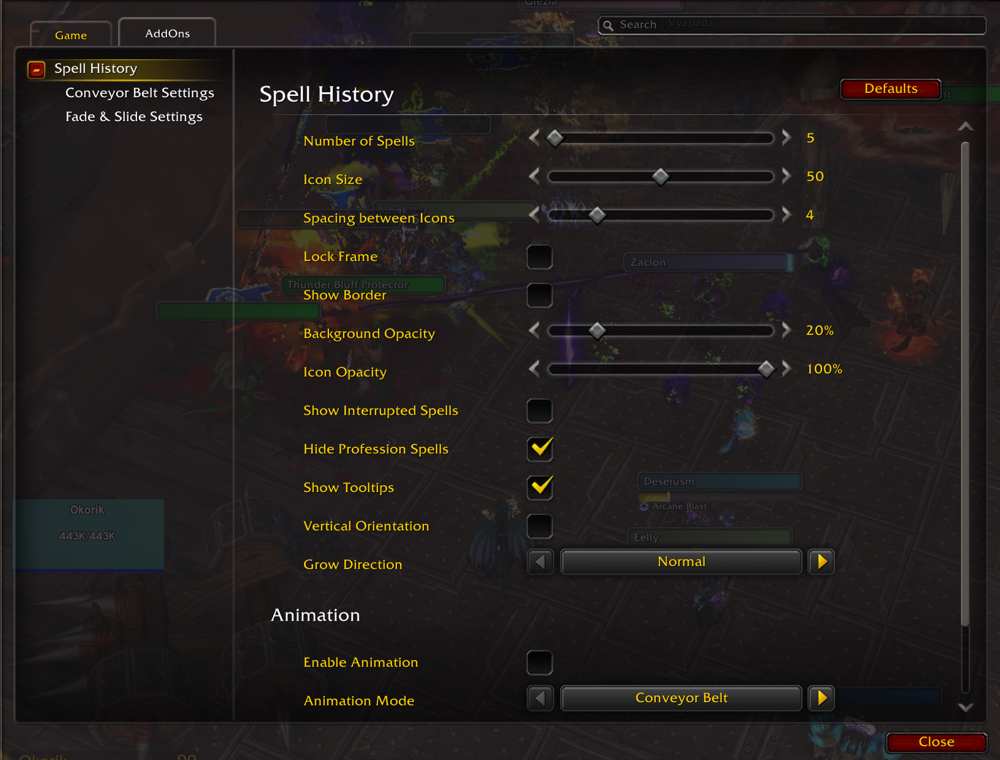
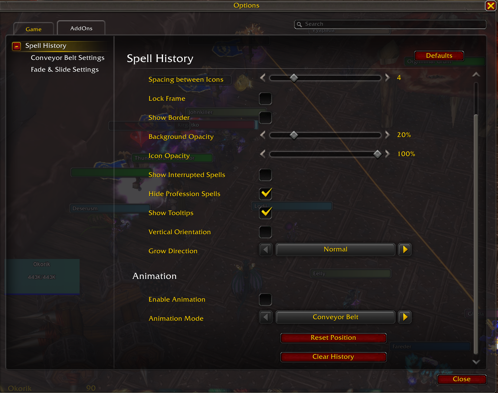

---

**SpellHistory** is a lightweight and customizable WoW addon that tracks and displays your recently cast spells as icons in a movable, animated bar

## Features

- **Visual Spell History**: Your last cast spells displayed as icons in a row or column
- **Interrupted/Failed Spell Tracking**: Red overlay on interrupted or failed casts
- **Fully Customizable** via the WoW Settings panel:
  - Number of spells shown (5–30)
  - Icon size (20–80 px) and opacity
  - Spacing between icons
  - Background opacity
  - Toggle border visibility
  - Optional: hide interrupted spells
  - Optional: hide profession spells (Blacksmithing, Alchemy, etc.)
  - Optional: show/hide tooltips on hover
  - Horizontal or vertical orientation
  - Grow direction (left-to-right, right-to-left, top-to-bottom, bottom-to-top)
- **Animation Modes** (each with their own sub-settings):
  - **Conveyor Belt** — icons travel across the bar and fade out at the end
  - **Fade In/Out** — icons appear and disappear at fixed positions
  - **Slide In/Out** — icons slide in, remain visible, then slide out
  - **No Animation** — static display
- **Movable & Lockable**: Drag the frame anywhere on screen, then lock it in place
- **Reset Position**: One-click button to return the frame to the screen center
- **Tooltips**: Hover over any icon to see spell name and cast result
- **Localized**: Full German (deDE) and English (enEN) support
- **WoW Midnight Compatible**: Built for WoW 12.0+

## Usage

### Slash Commands

| Command                  | Description             |
| ------------------------ | ----------------------- |
| `/spellhistory` or `/sh` | Open the settings panel |
| `/spellhistory clear`    | Clear the spell history |

## Settings Overview

### General

| Setting                     | Description                                       | Default  |
| --------------------------- | ------------------------------------------------- | -------- |
| **Number of Spells**        | How many spells to display                        | 10       |
| **Icon Size**               | Size of spell icons in pixels                     | 40 px    |
| **Spacing**                 | Space between icons                               | 5        |
| **Icon Opacity**            | Transparency of spell icons                       | 100%     |
| **Background Opacity**      | 0% = transparent, 100% = opaque                   | 50%      |
| **Show Border**             | Display border around the frame                   | Enabled  |
| **Lock Frame**              | Prevent the frame from being moved                | Disabled |
| **Vertical Orientation**    | Display icons in a column instead of a row        | Disabled |
| **Grow Direction**          | Direction new icons appear (Normal / Reverse)     | Normal   |
| **Show Interrupted Spells** | Display failed/interrupted casts with red overlay | Enabled  |
| **Hide Profession Spells**  | Filter out crafting/gathering spell casts         | Enabled  |
| **Show Tooltips**           | Show spell tooltip on icon hover                  | Enabled  |

### Animation

| Setting              | Description                                | Default       |
| -------------------- | ------------------------------------------ | ------------- |
| **Enable Animation** | Turn animation on or off                   | Disabled      |
| **Animation Mode**   | Conveyor Belt / Fade In-Out / Slide In-Out | Conveyor Belt |

#### Conveyor Belt Sub-Settings

| Setting             | Description                                | Default |
| ------------------- | ------------------------------------------ | ------- |
| **Travel Duration** | Seconds for an icon to travel the full bar | 8.0 s   |

#### Fade In/Out & Slide In/Out Sub-Settings

| Setting               | Description                                             | Default |
| --------------------- | ------------------------------------------------------- | ------- |
| **Fade In Duration**  | Seconds to fade in                                      | 0.3 s   |
| **Display Duration**  | Seconds an icon stays fully visible                     | 5.0 s   |
| **Fade Out Duration** | Seconds to fade out                                     | 0.5 s   |
| **Slide Distance**    | How far icons slide during fade in/out (% of icon size) | 50%     |

## Screenshots

## Support

- **Issues & Bug Reports**: [GitHub Issues](https://github.com/stgeipel/SpellHistory/issues)
- **Feature Requests**: [GitHub Issues](https://github.com/stgeipel/SpellHistory/issues)
